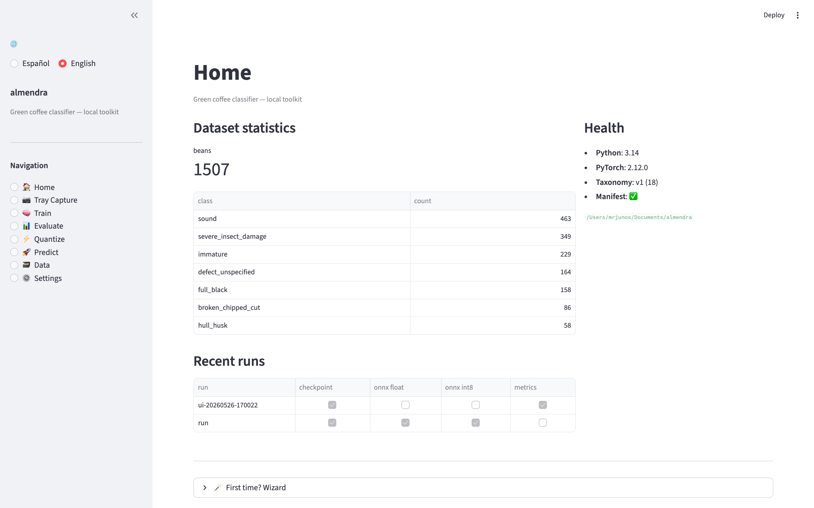
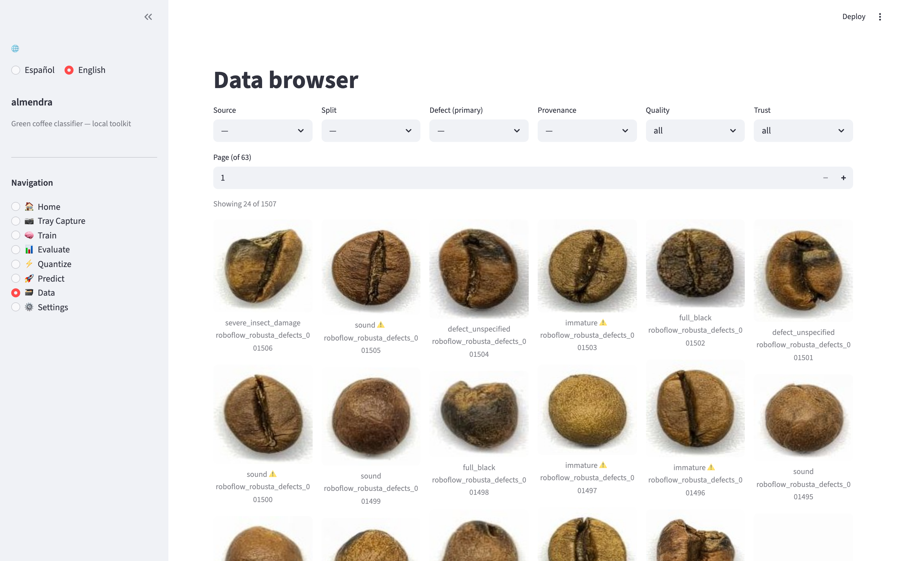
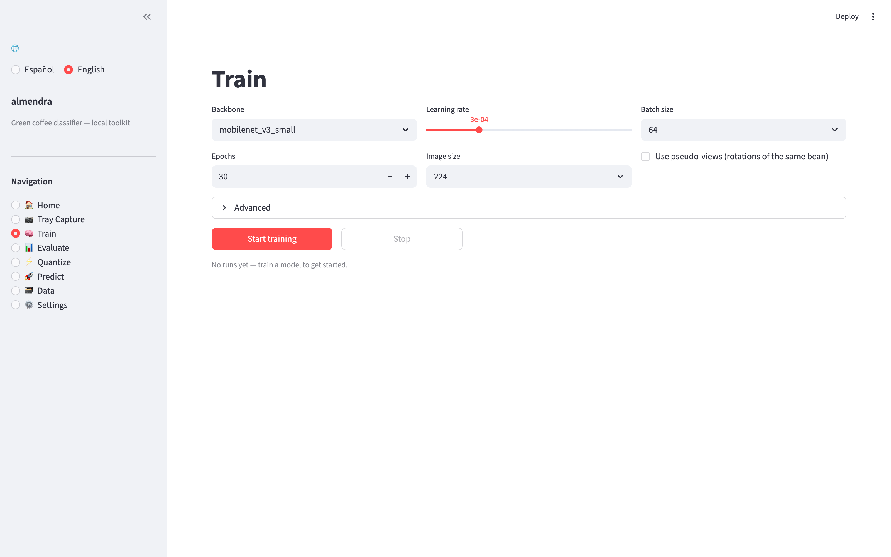

<div align="center">

# almendra

**A re-trainable AI system for grading green coffee beans, end-to-end — from data capture to a deployable INT8 model running at sorter speed.**

[](https://github.com/mrjunos/almendra/actions/workflows/ci.yml)
[](https://www.python.org/)
[](LICENSE)
[](docs/adr/0003-sca-aligned-provisional-taxonomy.md)

</div>

---

> *almendra* — what coffee farmers call the green coffee bean itself.

## Why this exists

In specialty coffee, **a single defect can downgrade a whole lot** — the difference between commodity and specialty grade is, by the SCA standard, no Category-1 defects and ≤5 Category-2 full defects in a 350 g sample. Today, that grading is done by hand: a skilled cupper sorts 100 g of green beans by sight. The cost is human, the throughput is low, and the result is non-reproducible.

almendra is the **end-to-end system** for replacing that manual step with a re-trainable model that can later run on a high-throughput sorting machine — built around three engineering principles:

- **Collect rich, deploy lean.** A laboratory rig captures every bean from several **viewing angles** under several **illumination spectra** (front-light, transillumination, UV). The model is trained with *view-dropout* so the **same model** also runs on a fast production rig that captures fewer views per bean.
- **The model is never the bottleneck.** A tiny INT8 backbone, batched across all views in flight, runs faster than beans can be singulated. Throughput comes from parallel lanes — not from rushing each bean.
- **Data is the product.** A centralised, multi-label catalog records every defect on every bean, with **provenance** (farm, variety, altitude, process, harvest dates, humidity) and **label trust** — so private high-trust data is never silently mixed with weakly-labelled public data.

The current deploy pick — set by an honest Pareto sweep across three backbones — is **MobileNetV3-Large + static INT8**: **0.86 macro-F1, 3.6 MB, ~430 beans/s on a single CPU thread**. See [`docs/research-log.md`](docs/research-log.md) for the full evidence trail.

## What's inside

A bilingual (ES/EN) local Streamlit app wraps the whole toolkit. A non-technical user can run almendra end-to-end without touching the CLI.

<p align="center">
  
</p>

| | Page | What it does |
|---|---|---|
| 🏠 | **Home** | Dataset stats, recent runs, health panel, first-time wizard. |
| 📷 | **Tray Capture** | Drag-and-drop tray photos; ArUco-rectified; per-bean crops saved. |
| 🧠 | **Train** | Pick backbone + key knobs, launch training, watch live charts. |
| 📊 | **Evaluate** | Per-class P/R/F1, **missed-defect rate**, mis-classified gallery. |
| ⚡ | **Quantize** | Export float ONNX + INT8 with parity check, see size reduction. |
| 🚀 | **Predict** | Upload a bean, get the multi-label verdict; **compare float vs INT8** side-by-side. |
| 🗃️ | **Data** | Browse the catalog: filter by source/split/defect/trust, inspect every bean. |
| ⚙️ | **Settings** | Canonical taxonomy, data sources with licence/status, current Hydra config. |

<p align="center">
  
</p>

## Quickstart

Requires [`uv`](https://docs.astral.sh/uv/).

```bash
# 1) Install (all extras — torch, onnx, streamlit, opencv, sqlmodel, …)
make setup

# 2) Sanity
make info        # canonical taxonomy + project status
make test        # full unit suite (~6 s)

# 3) Launch the UI
make ui          # → http://localhost:8501
```

A leaner install is fine too — every UI page degrades gracefully:

```bash
uv sync --extra dev                                      # lint + test only
uv sync --extra ui --extra train --extra export --extra capture --extra catalog
```

| Extra | Enables |
|---|---|
| `dev` | lint + test |
| `train` | model training (PyTorch) |
| `export` | ONNX + ONNX Runtime + INT8 quantization |
| `capture` | OpenCV / ArUco for tray rectification |
| `ui` | Streamlit + Plotly local app |
| `catalog` | SQLite catalog (SQLModel) + perceptual-hash dedup |
| `data` | Roboflow / Hugging Face / Kaggle dataset SDKs |
| `e2e` | full-browser visual E2E test (Playwright) |

## The five flows

### 1. Capture — proprietary data from a real tray

For your own beans (or any single-bean photos), the Tray Capture page rectifies an ArUco-cornered tray photo and slices it into per-bean crops with one click. The crop function is also a CLI:

```bash
uv run almendra tray-check --rows 6 --cols 8 --side-a tray_A.png
```

### 2. Ingest public datasets → the central catalog

```bash
export ROBOFLOW_API_KEY=...                              # never commit this
uv run python scripts/download_public_datasets.py        # also: make data
make ingest                                              # crop instances → manifest
make db-migrate                                          # manifest → catalog (idempotent)
make db-audit                                            # composition + integrity report
```

The **catalog** ([`data/catalog.db`](docs/adr/0006-centralized-bean-catalog.md), SQLite, Postgres-portable) is the source of truth: `source → lot → bean → bean_view`, with a `bean_defect` junction so **a single bean can carry several defects** (e.g. immature *and* insect-damaged) — each labelled with its `label_source` (`dataset` / `human_verified` / `model_weak`) and a `trust` score (0–1).

### 3. Curate — keep only good data

```bash
make db-curate           # = almendra db curate
```

Three idempotent passes — every verdict reversible, no files deleted:

- **Dedup** (perceptual hash) — on the real Roboflow Robusta set this flags **196 of 1507 beans (13%)** as near-duplicate augmented frames.
- **Quality filter** — too-small / near-blank crops.
- **Lossy-label trust** — lowers `trust` on documented questionable mappings (e.g. roboflow `Scorched → defect_unspecified` → 0.2).

Training and export are then gated on `is_good`, provenance (public-only by default — private is opt-in via `--all-provenance`) and a minimum trust threshold, so weak labels never silently dominate.

### 4. Train → evaluate → quantize

<p align="center">
  
</p>

```bash
make train                                               # multi-label, BCE + pos_weight
make eval ARGS="--checkpoint outputs/<run>/best.pt"
make export ARGS="--checkpoint outputs/<run>/best.pt"    # float ONNX + INT8 + parity check
make bench ARGS="--model outputs/<run>/model.int8.onnx"
```

The classifier is **multi-label**: 18 independent sigmoid outputs over the SCA taxonomy. `sound` = no defect predicted; **accept/reject = reject if any reject-class fires above threshold**. The headline metrics:

- **Macro-F1** over the classes actually present.
- **Missed-defect rate** — fraction of truly-defective beans predicted clean. The metric that matters most for a sorter.
- Per-class precision / recall / F1.
- Backbone Pareto + INT8 collapse analysis: [`docs/research-log.md`](docs/research-log.md).

See **ADR-0007** ([`docs/adr/0007-multi-label-defects.md`](docs/adr/0007-multi-label-defects.md)) for the model design.

### 5. Predict on one bean

Either via the **Predict** page (compare float vs INT8 side-by-side on the same image, with latency) or the CLI's ONNX path. The output is a *set* of defects with confidences + an accept/reject verdict driven by the taxonomy.

## Engineering rigor

- **Architecture Decision Records** ([`docs/adr/`](docs/adr/)) for every load-bearing choice: ADR record format, multi-view, SCA taxonomy contract, hardware-agnostic ONNX, gridded-tray capture, centralised catalog, multi-label classification.
- **Per-dataset datasheets** ([`docs/datasheets/`](docs/datasheets/)) in the spirit of *Datasheets for Datasets* (Gebru et al.) — licence, status, known limitations, lossy mappings. Datasets are **never redistributed**; each is pulled from its original host under its own licence.
- **Fixed taxonomy contract** — `index` values in [`data/taxonomy.yaml`](data/taxonomy.yaml) never change, only append; model outputs stay comparable across retrains.
- **Reproducible everything** — Hydra configs, seeded training, MLflow run tracking.
- **88 unit tests + a happy-path visual E2E** that drives the real UI in a browser (Tray → Train → Evaluate → Quantize → Predict → Data), records video, and serves as the CI gate.

```bash
make test                # fast unit suite (excludes e2e)
make e2e                 # full-browser, records to tests/e2e/recordings/
```

### CI/CD

- **`ci.yml`** — lint + unit tests on every push and PR; separate `e2e` job installs Chromium and uploads the recording as an artifact.
- **`ingest.yml`** — manual (`workflow_dispatch`) job that downloads + ingests + migrates into the catalog, reading **`ROBOFLOW_API_KEY`** from the encrypted GitHub secret. Manual-only on purpose: real downloads need credentials and would be wasteful per push.

Set the secret without it ever passing through a chat or shell history:

```bash
gh secret set ROBOFLOW_API_KEY --repo <owner>/almendra      # hidden prompt
```

## Repository layout

| Path | Purpose |
|---|---|
| `data/taxonomy.yaml` | Canonical SCA-aligned label schema — the source of truth. |
| `data/sources/` | Per-dataset adapters (licence, status, class mappings). |
| `data/catalog.db` | SQLite catalog of every bean (gitignored; regenerable from the manifest). |
| `configs/` | Hydra configs — compose model / data / training run. |
| `src/almendra/` | Package: `datasets`, `models`, `train`, `eval`, `export`, `bench`, `db`, `ui`. |
| `capture/` | Physical data-capture protocol + bill of materials. |
| `docs/` | Methodology, research log, ADRs, datasheets, UI guide. |
| `scripts/` | Utilities (e.g. public-dataset download). |
| `tests/` | Unit + the full E2E visual test (`tests/e2e/test_full_flow.py`). |
| `.github/workflows/` | `ci.yml`, `ingest.yml`. |

## Roadmap

- **Phase 0** — Scaffolding ✓
- **Phase 1** — Data pipeline + single-view public baseline ✓
- **Phase 2** — Multi-view fusion model ✓
- **Phase 3** — Physical capture protocol + proprietary Arabica data *(blocked on physical tray)*
- **Phase 4** — Multi-spectral illumination (UV, transillumination)
- **Phase 5** — Speed: backbone sweep, INT8, hardware benchmark ✓
- **Phase 6** — Local Streamlit UI ✓
- **Phase 7** — Centralised multi-label catalog + curation + Data browser + ingest CI/CD ✓
- **Phase 8** — Edge prototype: Raspberry Pi (model as-is) → ESP32-S3 (via Edge Impulse + QAT)
- *Parallel track* — NIR / hyperspectral internal-defect inspection.

## Research questions

Each has a measurable answer, tracked in [`docs/research-log.md`](docs/research-log.md):

1. Does multi-view fusion measurably lower the missed-defect rate vs a single view?
2. Does multi-spectral illumination catch defects that RGB front-light misses?
3. What is the accuracy / latency / model-size Pareto across backbones?
4. What accuracy is lost to INT8, per class?
5. How few deployment views can we use before per-class recall degrades?

## Data, licence & ethics

- **Code:** [Apache-2.0](LICENSE).
- **Datasets are never redistributed.** Each is downloaded from its original host under its own licence; provenance and licences are recorded in [`docs/datasheets/`](docs/datasheets/). License-blocked sources (e.g. `kaggle_17defects` until its licence is verified) are gated by the catalog and cannot be silently exported into training.
- The label taxonomy is currently **provisional** and aligned to — but not yet formally verified against — the official SCA Arabica Green Coffee Defect Handbook.

## Contributing

See [`CONTRIBUTING.md`](CONTRIBUTING.md). Contributions to data, defect taxonomy review, and hardware / capture design are especially welcome. Open an issue first for anything load-bearing — ADRs live in `docs/adr/`.

---

<div align="center">
<sub>Built as a long-lived investigation — small steps, rigorous evidence, reversible decisions.</sub>
</div>
